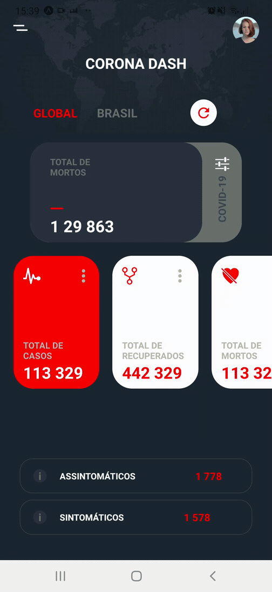
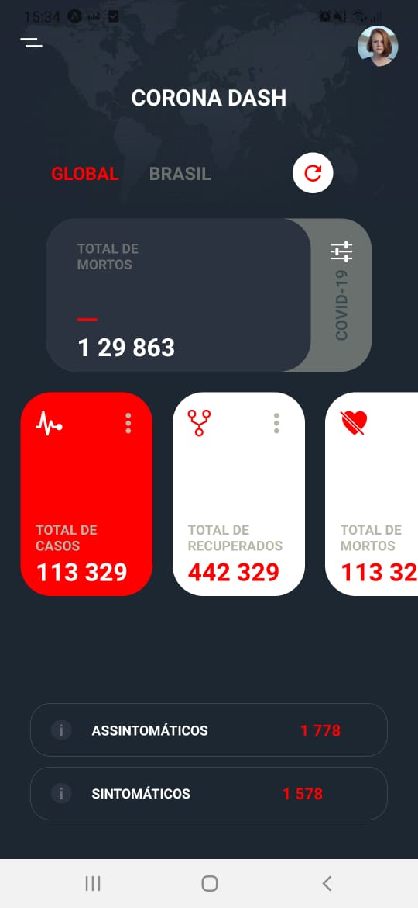
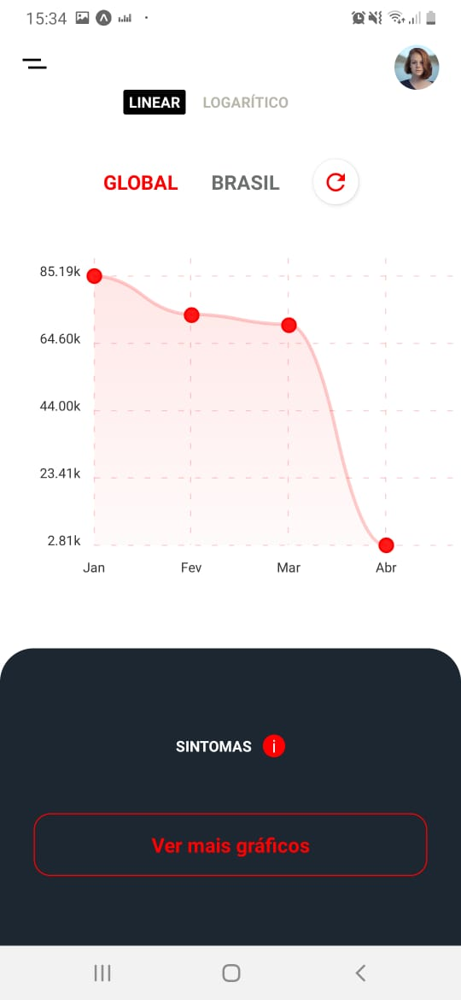

<h1 align="center">
<br>
CovidApp
<br>
<br>

</h1>

<p align="center">Este projeto é um aplicativo contendo informações (fictícias) sobre o CoronaVírus. O intuito desse app é treinar algumas funções do React Native, e também, treinar o design de Apps.</p>

<h1>💻Ferramentas Utilizadas</h1>
<h2>Recurso</h2>
<p>Para o desenvolvimento do projeto foi utilizada a seguinte tecnologia:</p> 

- ⚛️ **React Native** — Uma lib que permite criar apps nativos para Android e iOS (neste projeto foi utilizado o JS).
<br>
<h2>🚀Tecnologias</h2>
<h4>📱Mobile:</h4>
<ul>
 <li><a href="https://reactnative.dev/">React Native</a></li>
 <li><a href="https://expo.io/">Expo</a></li>
</ul>

<h2>📚Instalação</h2>
<h3>Mobile</h3>
<p>Clone esse projeto em seu computador e siga os seguintes passos:</p>

```
yarn global add install expo-cli
npm install
npm start
```

<h2>Referência</h2>
<p>- Esse conteúdo foi retirado do vídeo: https://www.youtube.com/watch?v=7E39zBTcF90</p>
 
<h2>Imagens do projeto final</h2>
<h1 align="center">
  
</h1>
